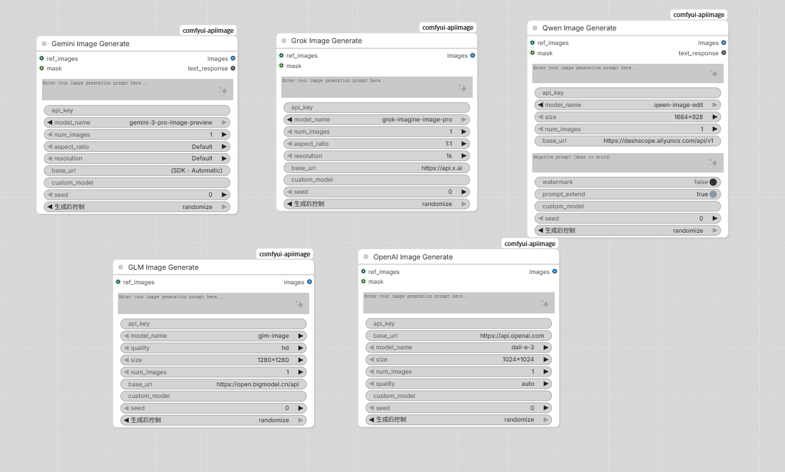

# ComfyUI-APIImage

**ComfyUI custom nodes for AI image generation via multiple API providers.**

Generate and edit images directly in ComfyUI using Google Gemini, xAI Grok, OpenAI (DALL-E / GPT-Image), Alibaba Qwen, and ZhipuAI GLM — all through a unified, easy-to-use node interface.


---



---

## Features

- **5 AI Providers** — Gemini, Grok, OpenAI-compatible, Qwen, and GLM in one plugin
- **Text-to-Image** — Generate images from text prompts with all providers
- **Image Editing** — Edit existing images with reference inputs (Gemini, Grok, OpenAI, Qwen)
- **Inpainting** — Mask-based inpainting support (Gemini, Grok, OpenAI, Qwen)
- **Persistent Configuration** — API keys and settings saved across sessions in `api_config.json`
- **Custom Models** — Dynamically add/remove models through Config nodes
- **Batch Generation** — Generate up to 4 images per request
- **Auto-Install** — Missing Python packages are installed automatically on first load

---

## Supported Nodes

| Node                      | Provider            | Capabilities                                                                                  |
| ------------------------- | ------------------- | --------------------------------------------------------------------------------------------- |
| **Gemini Image Generate** | Google Gemini       | Text-to-image, editing (up to 14 ref images), inpainting, aspect ratio, resolution (1K/2K/4K) |
| **Grok Image Generate**   | xAI Grok            | Text-to-image, editing (1 ref image), inpainting, aspect ratio, resolution                    |
| **OpenAI Image Generate** | OpenAI / Compatible | Text-to-image (DALL-E 3, GPT-Image-1), inpainting, custom size, quality control               |
| **Qwen Image Generate**   | Alibaba Qwen        | Text-to-image, editing (1-3 ref images), inpainting, negative prompt, watermark control       |
| **GLM Image Generate**    | ZhipuAI GLM         | Text-to-image, quality (HD/standard), multiple size presets                                   |
| **API Config Loader**     | —                   | Load saved API configurations with optional overrides                                         |
| **API Config Saver**      | —                   | Save API keys, URLs, and manage custom model lists                                            |
| **API Image Save**        | —                   | Save generated images to output directory with metadata                                       |

---

## Installation

### Method 1: ComfyUI Manager (Recommended)

Search for **"API Image Generator"** in ComfyUI Manager and install.

### Method 2: Manual Install

```bash
cd ComfyUI/custom_nodes
git clone https://github.com/YOUR_USERNAME/comfyui-apiimage.git
```

Dependencies are auto-installed on first load. To install manually:

```bash
pip install -r requirements.txt
```

### Dependencies

| Package        | Version   | Purpose                     |
| -------------- | --------- | --------------------------- |
| `google-genai` | >= 1.0.0  | Google Gemini SDK           |
| `xai_sdk`      | >= 1.5.0  | xAI Grok SDK                |
| `dashscope`    | >= 1.17.0 | Alibaba Qwen SDK            |
| `Pillow`       | >= 9.0.0  | Image processing            |
| `requests`     | >= 2.28.0 | HTTP requests (OpenAI, GLM) |

---

## Quick Start

### 1. Get API Keys

| Provider | Get Key                                                    |
| -------- | ---------------------------------------------------------- |
| Gemini   | [Google AI Studio](https://aistudio.google.com/apikey)     |
| Grok     | [xAI Console](https://console.x.ai)                        |
| OpenAI   | [OpenAI Platform](https://platform.openai.com/api-keys)    |
| Qwen     | [DashScope Console](https://dashscope.console.aliyun.com/) |
| GLM      | [ZhipuAI Platform](https://open.bigmodel.cn/)              |

### 2. Add a Generation Node

1. Right-click canvas > **Add Node** > **APIImage** > Choose your provider
2. Enter your **API Key** and **prompt**
3. Connect the output `images` to a **Preview Image** or **API Image Save** node
4. Click **Queue Prompt**

### 3. Basic Workflow

```
[Gemini Image Generate] --> [Preview Image]
         |
         +--> [API Image Save]
```

---

## Usage Guide

### Text-to-Image Generation

Simply enter a prompt and your API key. Select model and optional parameters:

- **Gemini**: Aspect ratio (1:1, 16:9, 9:16, etc.), Resolution (1K, 2K, 4K)
- **Grok**: Aspect ratio (1:1, 16:9, 9:16, 4:3, 3:4), Resolution (1k, 2k)
- **OpenAI**: Size (256x256 to 1792x1024), Quality (auto, high, standard)
- **Qwen**: Size presets (928x1664 to 1664x928), Negative prompt, Watermark toggle
- **GLM**: Quality (HD, standard), Multiple size presets per model

### Image Editing with References

Connect an image to the `ref_images` input to enter editing mode:

```
[Load Image] --> ref_images --> [Gemini Image Generate] --> [Preview Image]
```

**Reference image limits per model:**

| Model                                           | Max Ref Images |
| ----------------------------------------------- | -------------- |
| `gemini-2.5-flash-image`                        | 3              |
| `gemini-3-pro-image-preview`                    | 14             |
| `grok-imagine-image` / `grok-imagine-image-pro` | 1              |
| `gpt-image-1`                                   | 16             |
| `dall-e-2`                                      | 1              |
| `qwen-image-edit`                               | 3 (min 1)      |

### Inpainting

Connect both `ref_images` and `mask` inputs:

```
[Load Image] ----> ref_images --+
                                +--> [Generate Node] --> [Preview Image]
[Mask Editor] ---> mask --------+
```

### Persistent Configuration

Use **API Config Saver** to persist your settings:

```
[API Config Saver] -- save api_key, base_url, model
        |
[API Config Loader] -- load saved config --> [Generate Node]
```

### Custom Models

Add new models via the **API Config Saver** node:

1. Set `api_type` to your provider
2. Enter the model name in `add_custom_model_name`
3. Queue the node — the model will appear in dropdowns

Or override any model by filling the `custom_model` field on generation nodes.

---

## Configuration

API configurations are stored in `api_config.json` within the plugin directory. You can edit this file directly or use the Config nodes.

```json
{
  "api_configs": {
    "Gemini Native": {
      "api_key": "YOUR_KEY",
      "base_url": "(SDK - Automatic)",
      "model_name": "gemini-2.5-flash-image",
      "custom_models": []
    },
    "Grok API": {
      "api_key": "YOUR_KEY",
      "base_url": "https://api.x.ai",
      "model_name": "grok-imagine-image-pro",
      "custom_models": []
    }
  }
}
```

### Custom Base URL / Proxy

All nodes support custom `base_url` for proxy or self-hosted endpoints. Enter a valid `https://` URL to override the default endpoint.

---

## Built-in Models

| Provider | Models                                                 |
| -------- | ------------------------------------------------------ |
| Gemini   | `gemini-2.5-flash-image`, `gemini-3-pro-image-preview` |
| Grok     | `grok-imagine-image`, `grok-imagine-image-pro`         |
| OpenAI   | `dall-e-3`, `dall-e-2`, `gpt-image-1`                  |
| Qwen     | `qwen-image-plus`, `qwen-image-edit`                   |
| GLM      | `glm-image`, `cogview-4-250304`                        |

---

## File Structure

```
comfyui-apiimage/
  __init__.py          # Node registration & auto-install
  config.py            # Persistent config management
  utils.py             # Image tensor/PIL/bytes conversion utilities
  nodes_gemini.py      # Google Gemini node
  nodes_grok.py        # xAI Grok node
  nodes_openai.py      # OpenAI-compatible node
  nodes_qwen.py        # Alibaba Qwen node
  nodes_glm.py         # ZhipuAI GLM node
  nodes_config.py      # Config Loader & Saver nodes
  nodes_save.py        # Image save node
  api_config.json      # Saved API configurations
  requirements.txt     # Python dependencies
  pyproject.toml       # Package metadata
```

---

## Troubleshooting

| Error                         | Solution                                                  |
| ----------------------------- | --------------------------------------------------------- |
| `Authentication failed (401)` | Check your API key is correct and active                  |
| `Rate limit exceeded (429)`   | Wait a moment and retry, or switch models                 |
| `Model not found (404)`       | Verify model name; use `custom_model` for new models      |
| `Request timed out`           | Check network; try a simpler prompt; HD/4K may be slow    |
| `Content filtered`            | Modify your prompt — it may have triggered safety filters |
| `Missing package`             | Run `pip install -r requirements.txt` manually            |

---

## License

[MIT License](LICENSE)

---

## Contributing

Contributions are welcome! Please open an issue or pull request.

1. Fork the repository
2. Create a feature branch (`git checkout -b feature/new-provider`)
3. Commit your changes
4. Push to your branch and open a Pull Request
